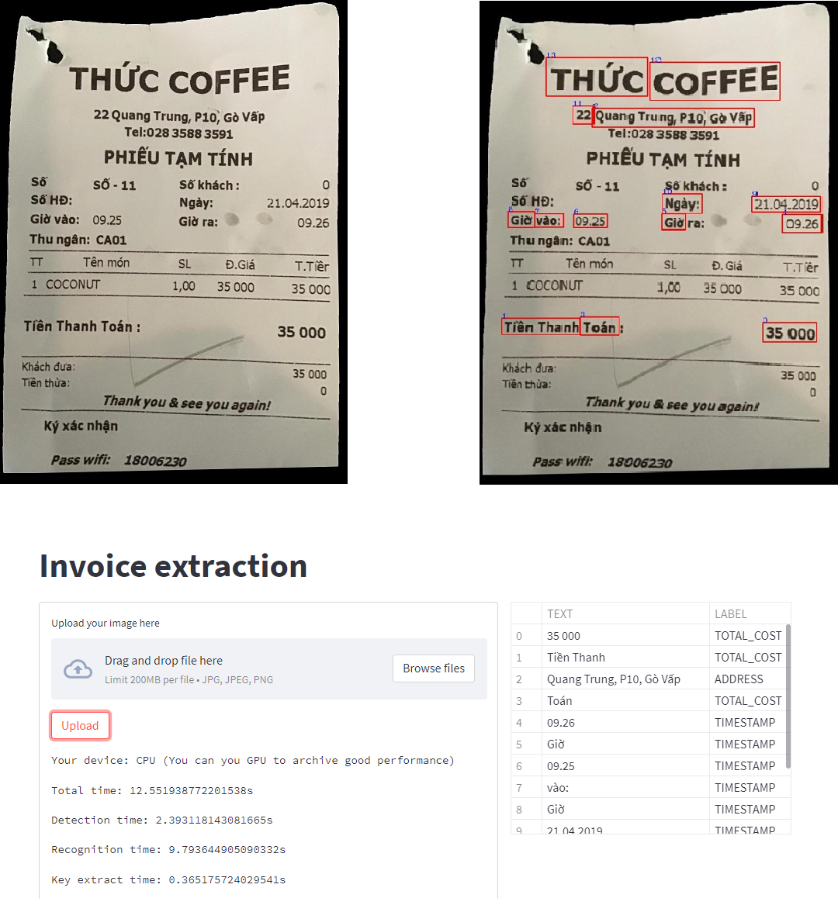

# Cài Đặt
Để cài đặt thực hiện gõ lệnh sau
```
pip install -r requirements.txt
```
# Khởi động server streamlit
Để khởi động server gõ lệnh sau
```
streamlit run app.py
```
Để thực hiện trích xuất hóa đơn phải có dạng như trong file data/image
# Kết quả nhận dạng
<p align="center">
    
</p>